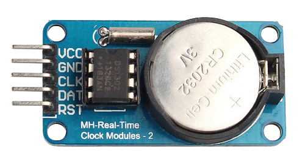

# ds1302-esp32s3
A basic example of how to interact with a ds1302 RTC using the esp-idf-hal on an esp32s3 microcontroller.

## What is the ds1302 RTC ?
The DS1302 trickle-charge timekeeping chip contains a real-time clock/calendar and 31 bytes of static RAM. It communicates with a microprocessor via a simple serial interface. The real-time clock/calendar provides seconds, minutes, hours, day, date, month, and year information. The end of the month date is automatically adjusted for months with fewer than 31 days, including corrections for leap year. The clock operates in either the 24-hour or 12-hour format with an AM/PM indicator. The chip driver is based on embedded-hal traits.

Datasheet : [DS1302](ds1302.pdf)

    
    
DS1302 RTC Board

## Why I made this
If you have been looking for how to make a ds1302 RTC work on an esp32 you will probably have found how to make it work on a RaspberryPi or in C++ and got very frustrated upon seeing that the datasheet is not very accessible.

Well now that I (mostly) understood it I make this so that no one will ever have to suffer through this again (hopefully).

This repository is inspired by [this one](https://github.com/sndnvaps/ds1302-drv/tree/main) as it teached me by example how to understand the datasheet.
